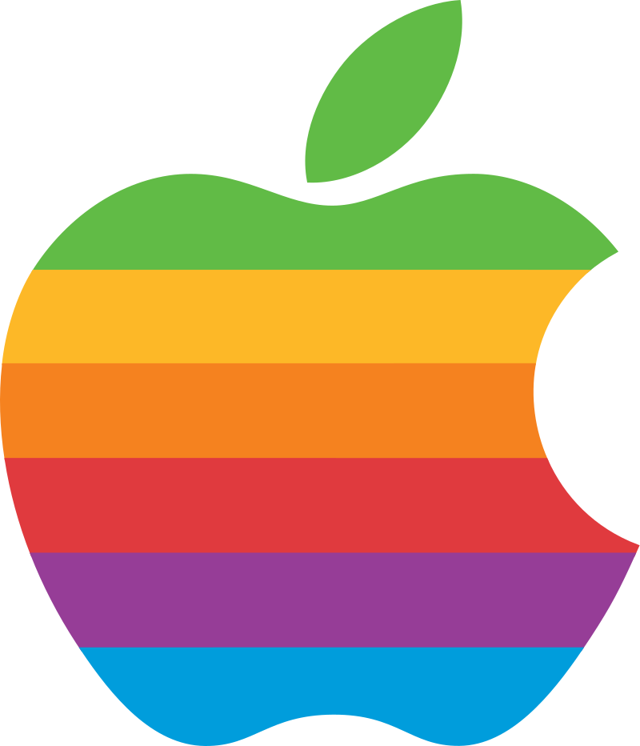

# Welcome to the official Dencrn GitHub page!

I primarily code in **HTML** as a hobby.
However, I'm mostly known for making any video that has a  logo on it, for some weird reason. 😨

I have over 150 subscribers on [YouTube](https://https://youtube.com/@dencrn) and over 5 followers on [Twitter](https://twitter.com/dencrn).  
**I am [Dencrn](COMING SOON!!), but you can call me Dean.**

* 📽️ Video Editor | 10+ Years of Overall experience. 3.5 Years experience with Premiere Pro, 2.5 Years experience with Vegas Pro, 2 Years experience with iMovie for iPad and **3 Years experience with Davinci Resolve**
* 💻 Low-level Coder (mainly HTML and occasionally PowerShell)
* 🏫 2023 High School Gruaduate

I also enjoy plenty of other activities. Mainly my music project, **WHTE** 
 
[SoundCloud](https://soundcloud.com/officialwhte)
 
[YouTube](https://youtube.com/@officialwhte)

### What's the project you're most proud of?
My top 3 popular videos on my channel.  
[1. My Updated Experiences With A Hackintosh in 2024 - IS IT STILL WORTH IT](https://www.youtube.com/watch?v=51ZynPX6Tao)
 
[2. My Experiences With Hackintosh in 2023 - IS IT WORTH IT](https://www.youtube.com/watch?v=v-BhA4df5bg)
 
[3. iPhone 12 Unboxing - IS IT ANY GOOD?](https://www.youtube.com/watch?v=VcoSSy38xgI)
 
### My Statistics

*This README file is best viewed on <strong>Windows 10</strong>
